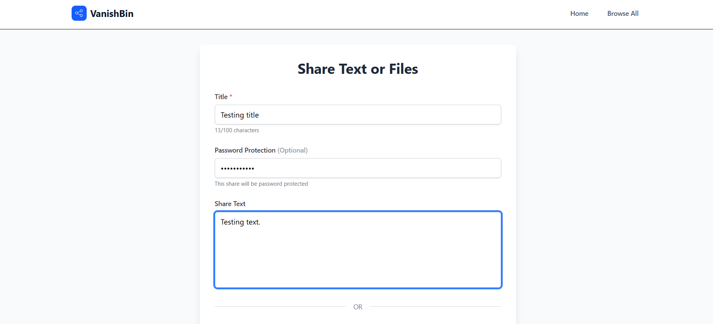

# VanishBin Backend API

A secure, temporary file and text sharing service backend built with Node.js, Express, MongoDB, and Supabase. VanishBin allows users to share text content and files with automatic expiration and optional password protection.


*VanishBin's clean and intuitive interface for managing temporary shares*

## Features

- **Secure Sharing**: Password protection with bcrypt encryption
- **Auto-Expiration**: Content automatically expires after 3 hours
- **File Upload**: Support for files up to 50MB via Supabase Storage
- **Text Sharing**: Share formatted text content
- **Rate Limiting**: Enhanced rate limiting with device fingerprinting
- **Auto-Cleanup**: Scheduled cleanup of expired content
- **Cloud Storage**: Files stored securely in Supabase
- **Health Monitoring**: Built-in health check and statistics endpoints
- **CORS Ready**: Configured for cross-origin requests

## Architecture

```
Backend/
├── config/           # Database and service configurations
├── controllers/      # Route handlers and business logic
├── middleware/       # Rate limiting, file upload, authentication
├── models/          # MongoDB schemas
├── routes/          # API route definitions
├── services/        # Background services (cleanup, change streams)
├── utils/           # Utility functions (device fingerprinting)
└── uploads/         # Local file storage (legacy)
```

## Quick Start

### Prerequisites

- Node.js (v16 or higher)
- MongoDB database
- Supabase account and project

### Installation

1. **Clone and navigate to backend directory**
   ```bash
   cd Backend
   npm install
   ```

2. **Environment Setup**
   ```bash
   cp .env.example .env
   ```

3. **Configure Environment Variables**
   Edit `.env` with your credentials:
   ```env
   # Server Configuration
   PORT=5000
   NODE_ENV=development

   # MongoDB Configuration
   MONGODB_URI=your_mongodb_connection_string_here

   # CORS Configuration
   FRONTEND_URL=http://localhost:3000

   # Supabase Configuration
   SUPABASE_URL=your_supabase_url_here
   SUPABASE_ANON_KEY=your_supabase_anon_key_here
   SUPABASE_SERVICE_ROLE_KEY=your_supabase_service_role_key_here
   SUPABASE_STORAGE_BUCKET=your_bucket_name_here
   ```

4. **Start the Server**
   ```bash
   # Development mode with auto-reload
   npm run dev

   # Production mode
   npm start
   ```

5. **Verify Installation**
   Visit `http://localhost:5000/health` to check server status.

## API Documentation

### Upload Content
**POST** `/api/upload`

Upload text content or files with optional password protection.


*Share text content with optional password protection*


*Upload files up to 50MB with automatic expiration*

**Request:**
- **Body (multipart/form-data):**
  - `title` (string, required): Title for the share
  - `text` (string, optional): Text content to share
  - `password` (string, optional): Password protection
  - `file` (file, optional): File to upload (max 50MB)

**Response:**
```json
{
  "success": true,
  "id": "unique_share_id",
  "url": "/api/unique_share_id",
  "downloadUrl": "/api/file/unique_share_id",
  "expiresAt": "2024-01-01T12:00:00.000Z"
}
```

### Get Content
**GET** `/api/:id`

Retrieve shared content by ID.

**Query Parameters:**
- `password` (string, optional): Required if content is password protected

**Response:**
```json
{
  "success": true,
  "data": {
    "title": "Share Title",
    "content": "Text content",
    "hasFile": true,
    "originalFileName": "document.pdf",
    "fileSize": 1024000,
    "mimeType": "application/pdf",
    "createdAt": "2024-01-01T09:00:00.000Z",
    "expiresAt": "2024-01-01T12:00:00.000Z"
  }
}
```

### Download File
**GET** `/api/file/:id`

Download file directly.

**Query Parameters:**
- `password` (string, optional): Required if content is password protected

### Administrative Endpoints

#### Get All Shares
**GET** `/api/all`

List all shares (useful for debugging).

#### Cleanup Statistics
**GET** `/api/cleanup/stats`

Get cleanup service statistics.

#### Manual Cleanup
**POST** `/api/cleanup`

Manually trigger cleanup of expired content.

#### Rate Limit Statistics
**GET** `/api/rate-limit/stats`

View rate limiting violation statistics.

#### Health Check
**GET** `/health`

Server health and status information.

## Security Features

### Rate Limiting
- **Global**: 1000 requests per 15 minutes per device
- **Upload**: 10 uploads per 15 minutes per device
- **Download**: 50 downloads per 15 minutes per device
- **Admin**: 20 requests per hour per device

### Device Fingerprinting
Enhanced rate limiting using combination of:
- IP address
- User-Agent
- Accept-Language
- Device characteristics

### Password Protection
- Bcrypt encryption with salt rounds
- Passwords excluded from API responses
- Secure password verification

### CORS Configuration
- Configurable allowed origins
- Credentials support
- Environment-specific settings

## Background Services

### Auto-Cleanup Service
- Runs every 60 minutes by default
- Removes expired shares from database
- Deletes associated files from Supabase
- Configurable via `ENABLE_SCHEDULED_CLEANUP` environment variable

### Change Stream Service
- MongoDB change streams for real-time monitoring
- Tracks database modifications
- Useful for debugging and analytics

## Monitoring

### Health Endpoint
The `/health` endpoint provides:
- Server status and uptime
- Memory usage statistics
- Storage backend status
- Service configuration status

### Error Handling
- Global error handler with detailed logging
- Multer-specific error handling for file uploads
- Graceful shutdown on SIGTERM
- 404 handler with available endpoints

## Configuration Options

### Environment Variables
| Variable | Description | Default |
|----------|-------------|---------|
| `PORT` | Server port | `5000` |
| `NODE_ENV` | Environment | `development` |
| `MONGODB_URI` | MongoDB connection string | Required |
| `FRONTEND_URL` | Frontend URL for CORS | Optional |
| `SUPABASE_URL` | Supabase project URL | Required |
| `SUPABASE_ANON_KEY` | Supabase anonymous key | Required |
| `SUPABASE_SERVICE_ROLE_KEY` | Supabase service role key | Required |
| `SUPABASE_STORAGE_BUCKET` | Supabase storage bucket name | Required |
| `ENABLE_SCHEDULED_CLEANUP` | Enable auto-cleanup | `true` |

### File Upload Limits
- Maximum file size: 50MB
- Request body limit: 50MB
- Supported: All file types
- Storage: Supabase Storage

## Development

### Available Scripts
```bash
npm start          # Production mode
npm run dev        # Development with nodemon
npm run test:supabase  # Test Supabase connection
```

### Testing
```bash
# Test Supabase connection
npm run test:supabase

# Test API endpoints
node test-api.js

# Test rate limiting
node test-rate-limiting.js

# Test cleanup service
node test-cleanup.js
```

### Database Migration
```bash
# Migrate shares to include new fields
node migrate-shares.js
```

## Data Models

### Share Schema
```javascript
{
  title: String (required, max 100 chars),
  password: String (optional, encrypted),
  content: String (optional),
  fileUrl: String (optional),
  supabaseFilePath: String (optional),
  originalFileName: String (optional),
  fileSize: Number (optional),
  mimeType: String (optional),
  createdAt: Date (default: now),
  expiresAt: Date (default: now + 3 hours)
}
```

## Error Handling

### Common Error Responses
- `400 Bad Request`: Missing required fields, invalid data
- `401 Unauthorized`: Incorrect password
- `404 Not Found`: Share not found or expired
- `429 Too Many Requests`: Rate limit exceeded
- `500 Internal Server Error`: Server or database errors

### File Upload Errors
- `LIMIT_FILE_SIZE`: File exceeds 50MB limit
- `LIMIT_UNEXPECTED_FILE`: Unexpected file field
- `LIMIT_FIELD_COUNT`: Too many form fields

## Security Best Practices

1. **Environment Variables**: Never commit `.env` files
2. **Password Hashing**: All passwords are bcrypt encrypted
3. **Input Validation**: Comprehensive validation on all inputs
4. **Rate Limiting**: Multi-layered protection against abuse
5. **File Security**: Files stored in secure cloud storage
6. **CORS**: Properly configured cross-origin policies
7. **Error Handling**: No sensitive information in error responses

## Contributing

1. Follow existing code style and conventions
2. Add appropriate error handling and logging
3. Update documentation for new features
4. Test thoroughly before submitting

## 📄 License

ISC License - see package.json for details.

## Support

For issues and questions:
1. Check the health endpoint: `/health`
2. Review server logs for detailed error information
3. Verify environment configuration
4. Test individual components with provided test files