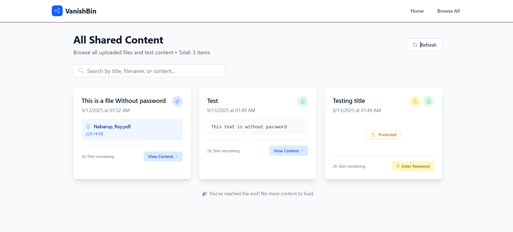

# VanishBin Frontend

A modern, secure frontend application for temporary file and text sharing built with Preact and Vite.


*VanishBin's clean and intuitive interface for managing temporary shares*

## Features

- **Secure File Sharing**: Upload and share files with auto-expiring links
- **Text Sharing**: Share text snippets with password protection
- **Modern UI**: Built with Tailwind CSS for a responsive, clean interface
- **Performance Optimized**: Lazy loading, code splitting, and optimized bundle size
- **Error Handling**: Comprehensive error boundaries and user feedback
- **PWA Ready**: Progressive Web App capabilities for better user experience
- **Multiple Deployment Options**: Ready for Netlify, Vercel, and other platforms

## Tech Stack

- **Framework**: [Preact](https://preactjs.com/) - Fast 3kB alternative to React
- **Build Tool**: [Vite](https://vitejs.dev/) - Lightning fast build tool
- **Styling**: [Tailwind CSS](https://tailwindcss.com/) - Utility-first CSS framework
- **Routing**: [Preact Router](https://github.com/preactjs/preact-router) - Client-side routing
- **Development**: ES6+, Modern JavaScript

## Application Screenshots

### Text Sharing Interface

*Clean interface for sharing text content with optional password protection*

### File Upload Interface

*Drag-and-drop file upload with progress indicators and security options*

### Content Management

*Browse and manage all shared content with detailed information*

## Project Structure

```
src/
├── components/          # Reusable UI components
│   ├── AllContentPage.jsx       # Content listing page
│   ├── ErrorBoundary.jsx        # Error handling components
│   ├── Footer.jsx               # Application footer
│   ├── Header.jsx               # Application header
│   ├── NotFound.jsx            # 404 page component
│   ├── ResultCard.jsx          # Upload result display
│   ├── Toast.jsx               # Notification system
│   ├── UploadForm.jsx          # File/text upload form
│   └── ViewPage.jsx            # Content viewing page
├── config/              # Configuration files
│   └── api.js                  # API endpoints configuration
├── utils/               # Utility functions
│   ├── errorHandler.js         # Error handling utilities
│   ├── helpers.js              # Common helper functions
│   ├── lazyLoading.jsx         # Lazy loading implementation
│   └── passwordCache.js        # Password caching utilities
├── assets/              # Static assets
├── app.jsx              # Main application component
├── main.jsx             # Application entry point
├── app.css              # Global styles
└── index.css            # Base styles
```

## Quick Start

### Prerequisites

- Node.js (v18 or higher)
- npm or yarn package manager

### Installation

1. **Clone the repository**
   ```bash
   https://github.com/NabarupDev/VanishBin
   cd Frontend
   ```

2. **Install dependencies**
   ```bash
   npm install
   ```

3. **Environment Setup**
   ```bash
   cp .env.example .env
   ```
   
   Configure your environment variables:
   ```env
   VITE_API_URL=http://localhost:5000/api
   ```

4. **Start development server**
   ```bash
   npm run dev
   ```

The application will be available at `http://localhost:3000`

## Available Scripts

- `npm run dev` - Start development server with hot reload
- `npm run build` - Build production bundle
- `npm run preview` - Preview production build locally

## Configuration

### Environment Variables

| Variable | Description | Default |
|----------|-------------|---------|
| `VITE_API_URL` | Backend API URL | `http://localhost:5000/api` |

### Vite Configuration

The project uses Vite for build tooling with the following key configurations:

- **Development Server**: Runs on port 3000 with API proxy
- **Build Optimization**: Code splitting and lazy loading
- **Preact Integration**: Optimized for Preact framework
- **Tailwind CSS**: Integrated build process

## Styling

The application uses Tailwind CSS for styling with:

- **Utility-first approach**: Rapid UI development
- **Responsive design**: Mobile-first responsive layouts
- **Custom configuration**: Tailored color scheme and spacing
- **Component-based styles**: Reusable style patterns

## Deployment

### Netlify

The project includes Netlify configuration (`netlify.toml`):

```bash
npm run build
# Deploy the dist/ folder to Netlify
```

### Vercel

The project includes Vercel configuration (`vercel.json`):

```bash
npm run build
# Deploy using Vercel CLI or GitHub integration
```

### Manual Deployment

1. Build the project:
   ```bash
   npm run build
   ```

2. Deploy the `dist/` folder to your hosting provider

## Development Guidelines

### Code Structure

- **Components**: Keep components small and focused
- **Utilities**: Extract reusable logic into utility functions
- **Lazy Loading**: Use lazy loading for route-based code splitting
- **Error Handling**: Implement proper error boundaries

### Performance Considerations

- **Lazy Loading**: Components are lazy-loaded for optimal performance
- **Bundle Splitting**: Automatic code splitting by route
- **Asset Optimization**: Images and assets are optimized during build
- **Caching**: Proper cache headers for static assets

## Error Handling

The application includes comprehensive error handling:

- **Error Boundaries**: Catch and handle React errors gracefully
- **API Error Handling**: Proper error responses from backend
- **User Feedback**: Toast notifications for user actions
- **Fallback UI**: Graceful degradation for failed components

## Security Features

- **Content Security Policy**: Implemented for XSS protection
- **File Validation**: Client-side file type and size validation
- **Password Protection**: Optional password protection for shares
- **Secure Headers**: Production security headers configured

## Progressive Web App

The application is configured as a PWA with:

- **Service Worker**: Offline capabilities (when implemented)
- **Manifest**: App installation support
- **Responsive Design**: Works on all device sizes

## Contributing

1. Fork the repository
2. Create a feature branch: `git checkout -b feature-name`
3. Make your changes and test thoroughly
4. Commit with descriptive messages: `git commit -m "Add feature"`
5. Push to your fork: `git push origin feature-name`
6. Create a Pull Request

## 📄 License

This project is licensed under the MIT License - see the LICENSE file for details.

## Related

- **[Backend Repository](../Backend/)** - The backend API for VanishBin
- **[API Documentation](../Backend/README.md)** - Backend API endpoints and usage
- **[Main Project](../README.md)** - Overview and setup instructions

## Support

For support, please open an issue in the GitHub repository or contact the maintainers.

---

**Built with modern web technologies for optimal performance and security**