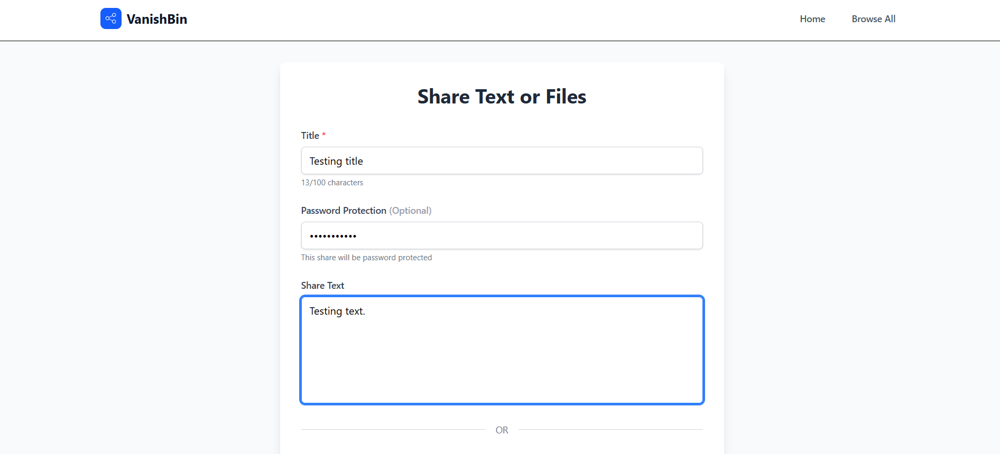
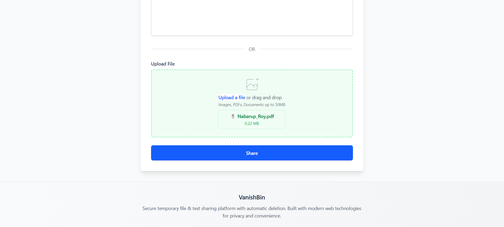
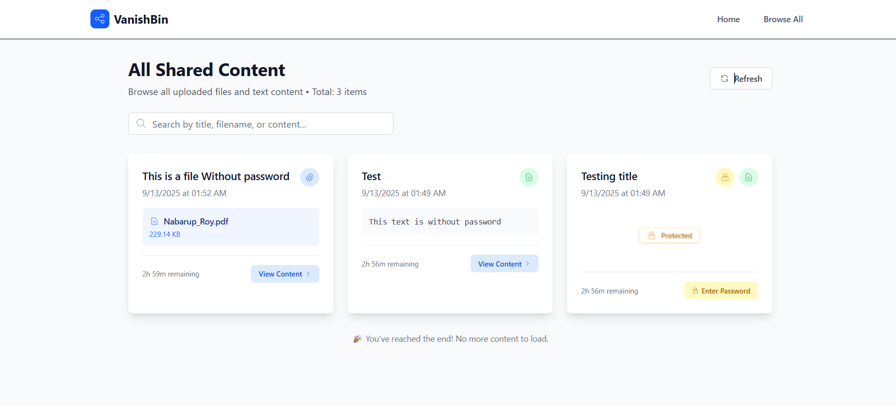

# VanishBin

**VanishBin** is a secure, temporary file and text sharing service that automatically expires content after 3 hours. Built with modern web technologies for privacy-conscious users who need to share sensitive information quickly and securely.

## Key Features

- **Security First**: Password protection with bcrypt encryption
- **Auto-Expiration**: All content automatically expires after 3 hours
- **File Sharing**: Support for files up to 50MB
- **Text Sharing**: Share formatted text content with syntax highlighting
- **Rate Limiting**: Enhanced protection against abuse
- **Cloud Storage**: Secure file storage with Supabase
- **Cross-Platform**: Works on all modern browsers and devices
- **Fast & Lightweight**: Built with Preact for optimal performance

## Screenshots

### Share Text Content

*Easily share text snippets with optional password protection*

### Share Files

*Upload and share files up to 50MB with automatic expiration*

### View All Content

*Browse and manage all shared content in one place*

## Architecture

VanishBin consists of two main components:

- **Frontend**: Modern Preact application with Tailwind CSS
- **Backend**: Node.js API with Express, MongoDB, and Supabase

```
VanishBin/
├── Frontend/          # Preact + Vite frontend application
├── Backend/           # Node.js + Express API server
├── Assets/            # Screenshots and documentation images
└── README.md          # This file
```

## Quick Start

### Prerequisites

- Node.js (v16 or higher)
- MongoDB database
- Supabase account
- Git

### 1. Clone the Repository

```bash
git clone https://github.com/NabarupDev/VanishBin.git
cd VanishBin
```

### 2. Backend Setup

```bash
cd Backend
npm install

# Copy environment template
cp .env.example .env

# Configure your .env file with:
# - MongoDB connection string
# - Supabase credentials
# - Other required settings

npm run dev
```

The backend will start on `http://localhost:5000`

### 3. Frontend Setup

```bash
cd Frontend
npm install

# Configure environment
cp .env.example .env

# Set VITE_API_URL=http://localhost:5000/api

npm run dev
```

The frontend will start on `http://localhost:3000`

### 4. Access the Application

Open your browser and navigate to `http://localhost:3000` to start using VanishBin!

## Documentation

- **[Backend Documentation](./Backend/README.md)** - API endpoints, configuration, and deployment
- **[Frontend Documentation](./Frontend/README.md)** - Component structure, styling, and deployment

## Environment Configuration

### Backend (.env)
```env
PORT=5000
NODE_ENV=development
MONGODB_URI=your_mongodb_connection_string
FRONTEND_URL=http://localhost:3000
SUPABASE_URL=your_supabase_url
SUPABASE_ANON_KEY=your_supabase_anon_key
SUPABASE_SERVICE_ROLE_KEY=your_service_role_key
SUPABASE_STORAGE_BUCKET=your_bucket_name
```

### Frontend (.env)
```env
VITE_API_URL=http://localhost:5000/api
```

## Security Features

- **Password Protection**: Optional bcrypt-encrypted passwords
- **Auto-Expiration**: Content automatically deleted after 3 hours
- **Rate Limiting**: Device fingerprinting and request limits
- **Secure File Storage**: Files stored in Supabase with secure URLs
- **CORS Protection**: Properly configured cross-origin policies
- **Input Validation**: Comprehensive validation on all user inputs

## Deployment

### Production Deployment Options

#### Option 1: Netlify + Heroku
- **Frontend**: Deploy to Netlify using the included `netlify.toml`
- **Backend**: Deploy to Heroku or any Node.js hosting service

#### Option 2: Vercel + Railway
- **Frontend**: Deploy to Vercel using the included `vercel.json`
- **Backend**: Deploy to Railway or similar service

#### Option 3: Self-Hosted
- Deploy both frontend and backend on your own servers
- Use a reverse proxy (nginx) to serve both applications

## API Overview

### Core Endpoints

| Method | Endpoint | Description |
|--------|----------|-------------|
| `POST` | `/api/upload` | Upload text or file content |
| `GET` | `/api/:id` | Retrieve shared content |
| `GET` | `/api/file/:id` | Download file directly |
| `GET` | `/api/all` | List all shares (admin) |
| `GET` | `/health` | Server health check |

### Example Usage

**Upload Text:**
```javascript
const response = await fetch('/api/upload', {
  method: 'POST',
  body: formData // title, text, password (optional)
});
```

**Retrieve Content:**
```javascript
const response = await fetch('/api/abc123?password=secret');
const data = await response.json();
```

## Testing

### Backend Tests
```bash
cd Backend
npm run test:supabase    # Test Supabase connection
node test-api.js         # Test API endpoints
node test-rate-limiting.js  # Test rate limiting
```

### Manual Testing
1. Upload a text snippet
2. Upload a file with password protection
3. Verify expiration works after 3 hours
4. Test rate limiting with multiple requests

## 🤝 Contributing

We welcome contributions! Please follow these steps:

1. **Fork the repository**
2. **Create a feature branch**: `git checkout -b feature/amazing-feature`
3. **Make your changes** and test thoroughly
4. **Commit your changes**: `git commit -m 'Add amazing feature'`
5. **Push to the branch**: `git push origin feature/amazing-feature`
6. **Open a Pull Request**

### Development Guidelines

- Follow existing code style and conventions
- Add appropriate error handling and logging
- Update documentation for new features
- Ensure all tests pass before submitting
- Keep commits atomic and well-described

## Troubleshooting

### Common Issues

**Backend won't start:**
- Check MongoDB connection string
- Verify Supabase credentials
- Ensure all environment variables are set

**Frontend can't connect to backend:**
- Verify `VITE_API_URL` in frontend `.env`
- Check CORS configuration in backend
- Ensure backend is running on correct port

**File uploads failing:**
- Check Supabase storage bucket configuration
- Verify file size limits (50MB max)
- Ensure proper Supabase permissions

### Getting Help

1. Check the `/health` endpoint for server status
2. Review server logs for detailed error information
3. Verify environment configuration
4. Open an issue on GitHub with detailed information

## 📄 License

This project is licensed under the ISC License - see the [LICENSE](LICENSE) file for details.

## 🙏 Acknowledgments

- **Preact Team** - For the lightweight React alternative
- **Supabase** - For excellent backend-as-a-service
- **Tailwind CSS** - For the utility-first CSS framework
- **MongoDB** - For reliable document database
- **Vite** - For lightning-fast build tooling

## 🔗 Links

- **Live Demo**: [Live Demo](https://vanishbin.vercel.app/)
- **Documentation**: [Backend](./Backend/README.md) | [Frontend](./Frontend/README.md)
- **Issues**: [GitHub Issues](https://github.com/NabarupDev/VanishBin/issues)
- **Discussions**: [GitHub Discussions](https://github.com/NabarupDev/VanishBin/discussions)

---

**Made with ❤️ by [NabarupDev](https://github.com/NabarupDev)**

*VanishBin - Because privacy matters, and temporary should mean temporary.*
